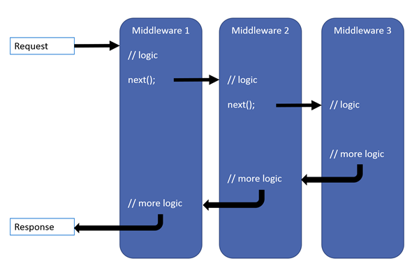
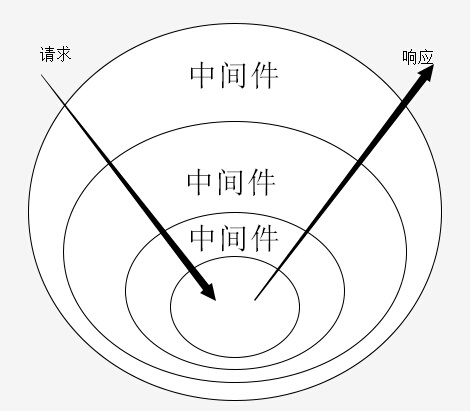
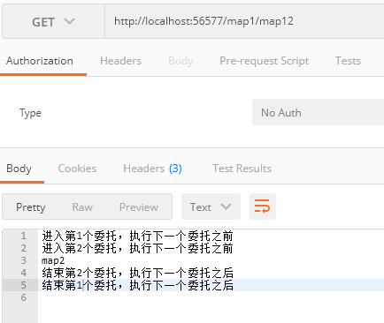
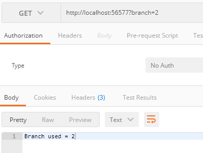
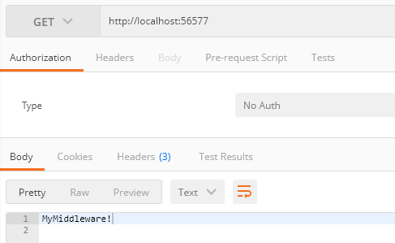
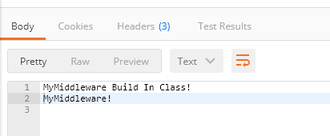

中间件是用于组成应用程序管道来处理请求和响应的组件。管道内的每一个组件都可以选择是否将请求交给下一个组件、并在管道中调用下一个组件之前和之后执行某些操作。请求委托被用来建立请求管道，请求委托处理每一个 HTTP 请求。



每个委托可以在下一个委托之前和之后执行操作。委托还可以决定不将请求传递给下一个委托，这称为请求管道的短路。

### Run

最简单的可能是ASP.NET Core应用程序建立一个请求的委托，处理所有的请求。此案例不包含实际的请求管道。相反，针对每个HTTP请求都调用一个匿名方法。

```csharp
app.Run(async (context) =>
{
    await context.Response.WriteAsync("Hello World!");
});
```
不管在浏览器地址栏输入什么，都会返回"Hello World!"


第一个**app.Run**委托会终止管道
```csharp
app.Run(async (context) =>
{
    await context.Response.WriteAsync("Hello World!");
});

app.Run(async (context) =>
{
    await context.Response.WriteAsync("管道已经被终止!");
});
```
只有"Hello World!"会被返回
### Use
如果需要使用多个委托处理HTTP请求，可以使用**Use**将他们链接在一起。

```csharp
app.Use(async (context, next) =>
{
    await context.Response.WriteAsync("进入第1个委托，执行下一个委托之前\r\n");
    await next();
    await context.Response.WriteAsync("结束第1个委托，执行下一个委托之后\r\n");
});
app.Use(async (context, next) =>
{
    await context.Response.WriteAsync("进入第2个委托，执行下一个委托之前\r\n");
    await next();
    await context.Response.WriteAsync("结束第2个委托，执行下一个委托之后\r\n");
});
app.Run(async (context) =>
{
    await context.Response.WriteAsync("Hello World!\r\n");
});
```


nodejs koa 洋葱模型



中间件的注册顺序也很重要

```csharp
    app.UseExceptionHandler("/Error");
    // Use HTTPS Redirection Middleware to redirect HTTP requests to HTTPS.
    app.UseHttpsRedirection();

    // Return static files and end the pipeline.
    app.UseStaticFiles();

    // Use Cookie Policy Middleware to conform to EU General Data 
    // Protection Regulation (GDPR) regulations.
    app.UseCookiePolicy();

    // Authenticate before the user accesses secure resources.
    app.UseAuthentication();

    // If the app uses session state, call Session Middleware after Cookie 
    // Policy Middleware and before MVC Middleware.
    app.UseSession();

    // Add MVC to the request pipeline.
    app.UseMvc();
```

异常处理中间件应该放到第一个，这样它就能捕获后面调用中发生的任何异常。

将非HTTPS重定向到HTTP域的中间件也应该比较前面，如果先经过Session等中间件处理，就会浪费服务器资源做不必要的解析。

尽早在管道中调用静态文件中间件，以便它可以处理请求并使其短路，而无需通过剩余组件。

身份验证的中间件(**app.UseAuthentication()**)不会使请求发生短路，作用是设置**HttpContext.User**上相关信息，短路操作是在MVC控制器执行的时候(加上**Authorize**特性)。

>[UseAuthentication源码](https://github.com/aspnet/AspNetCore/blob/master/src/Security/Authentication/Core/src/AuthenticationMiddleware.cs)，[Authorize特性源码](https://github.com/aspnet/AspNetCore/blob/master/src/Mvc/src/Microsoft.AspNetCore.Mvc.Core/Authorization/AuthorizeFilter.cs)


### Map
Map 扩展用来创建管道分支。 Map* 基于给定请求路径的匹配项来创建请求管道分支。 如果请求路径以给定路径开头，则执行分支
```csharp
app.Map("/map1", (level1app) =>
{
    level1app.Use(async (context, next) =>
    {
        await context.Response.WriteAsync("进入第1个委托，执行下一个委托之前\r\n");
        await next();
        await context.Response.WriteAsync("结束第1个委托，执行下一个委托之后\r\n");
    });
    level1app.Use(async (context, next) =>
    {
        await context.Response.WriteAsync("进入第2个委托，执行下一个委托之前\r\n");
        await next();
        await context.Response.WriteAsync("结束第2个委托，执行下一个委托之后\r\n");
    });
    level1app.Map("/map12", (level2app) =>
    {
        //level1app.use 注册的委托会调用
        level2app.Run(async (context) =>
        {
            await context.Response.WriteAsync("map2\r\n");
        });
    });
    level1app.Run(async (context) =>
    {
        await context.Response.WriteAsync("map1\r\n");
    });
    //不管app.run 在 level1app.Run之前还是之后，分支管道都会被阻断，没有任何输出
    //app.Run(async (context) =>
    //{
    //    await context.Response.WriteAsync("Hello World!\r\n");
    //});
});
```



MapWhen 基于给定谓词的结果创建请求管道分支。 Func<HttpContext, bool> 类型的任何谓词均可用于将请求映射到管道的新分支。 在以下示例中，谓词用于检测查询字符串变量 branch 是否存在：

```csharp
app.MapWhen(context => context.Request.Query.ContainsKey("branch"), (level1app) =>
{
    level1app.Run(async (context) =>
    {
        var branchVer = context.Request.Query["branch"];
        await context.Response.WriteAsync($"Branch used = {branchVer}");
    });
});

```


### 内置中间件

ASP.NET Core 附带以下中间件组件。

|中间件|描述|顺序|
|---|---|---|
|身份验证|提供身份验证支持。|在需要 HttpContext.User 之前。 OAuth 回叫的终端。
|Cookie 策略|跟踪用户是否同意存储个人信息，并强制实施 cookie 字段（如 secure 和 SameSite）的最低标准。|在发出 cookie 的中间件之前。 示例：身份验证、会话、MVC (TempData)。
|CORS|配置跨域资源共享。|在使用 CORS 的组件之前。
|诊断|配置诊断。|在生成错误的组件之前。
|转接头|将代理标头转发到当前请求。|在使用已更新字段的组件之前。 示例：方案、主机、客户端 IP、方法。
|运行状况检查|检查 ASP.NET Core 应用及其依赖项的运行状况，如检查数据库可用性。|如果请求与运行状况检查终结点匹配，则为终端。
|HTTP 方法重写|允许传入 POST 请求重写方法。|在使用已更新方法的组件之前。
|HTTPS 重定向|将所有 HTTP 请求重定向到 HTTPS（ASP.NET Core 2.1 或更高版本）。|在使用 URL 的组件之前。
|HTTP 严格传输安全性 (HSTS) |添加特殊响应标头的安全增强中间件（ASP.NET Core 2.1 或更高版本）。|在发送响应之前，修改请求的组件之后。 示例：转接头、URL 重写。
|MVC|用 MVC/Razor Pages 处理请求（ASP.NET Core 2.0 或更高版本）。|如果请求与路由匹配，则为终端。
|OWIN|与基于 OWIN 的应用、服务器和中间件进行互操作。|如果 OWIN 中间件处理完请求，则为终端。
|响应缓存|提供对缓存响应的支持。|在需要缓存的组件之前。
|响应压缩|提供对压缩响应的支持。|在需要压缩的组件之前。
|请求本地化|提供本地化支持。|在对本地化敏感的组件之前。
|路由|定义和约束请求路由。|用于匹配路由的终端。
|会话|提供对管理用户会话的支持。|在需要会话的组件之前。
|静态文件|为提供静态文件和目录浏览提供支持。|如果请求与文件匹配，则为终端。
|URL 重写|提供对重写 URL 和重定向请求的支持。|在使用 URL 的组件之前。
|WebSockets |启用 WebSockets 协议。|在接受 WebSocket 请求所需的组件之前。

### 编写中间件

通常，中间件通过扩展方法公开。

`MyMiddlewareExtensions.cs`
```csharp
public static class MyMiddlewareExtensions
{
    public static IApplicationBuilder UseMyMiddleware(this IApplicationBuilder app)
    {
        app.Run(async (context) =>
        {
            await context.Response.WriteAsync("MyMiddleware!\r\n");
        });
        return app;
    }
}
```
>是否阻断管道由中间件控制

```csharp
app.UseMyMiddleware();
```


**将中间件委托移到类中**

`MyMiddleware.cs`
```csharp
public class MyMiddleware
{
    private readonly RequestDelegate _next;

    public MyMiddleware(RequestDelegate next)
    {
        _next = next;
    }

    public async Task InvokeAsync(HttpContext context)
    {
        await context.Response.WriteAsync("MyMiddleware Build In Class!\r\n");
        await _next(context);//不调用next，则阻断管道
    }
}
```
`MyMiddlewareExtensions.cs`
```csharp
public static class MyMiddlewareExtensions
{
    public static IApplicationBuilder UseMyMiddleware(this IApplicationBuilder app)
    {
        app.Run(async (context) =>
        {
            await context.Response.WriteAsync("MyMiddleware!\r\n");
        });
        return app;
    }
    public static IApplicationBuilder UseMyMiddlewareByClass(this IApplicationBuilder app)
    {
        app.UseMiddleware<MyMiddleware>();
        return app;
    }
}
```
```csharp
app.UseMyMiddlewareByClass();
app.UseMyMiddleware();
```


**接收参数**
中间件组件可以通过构造方法参数来解析依赖注入的依赖关系。 UseMiddleware也可以直接接受其他参数。

```csharp
public static IApplicationBuilder UseMyMiddlewareByClass(this IApplicationBuilder app,string otherParams="")
{
    app.UseMiddleware<MyMiddleware>(otherParams);
    return app;
}
```
```csharp
 public class MyMiddleware
{
    private readonly RequestDelegate _next;
    private string _otherParams;

    public MyMiddleware(RequestDelegate next,string otherParams)
    {
        _next = next;
        _otherParams = otherParams;
    }

    public async Task InvokeAsync(HttpContext context)
    {
        await context.Response.WriteAsync(string.Format("otherParams:{0}\r\n", _otherParams));
        await context.Response.WriteAsync("MyMiddleware Build In Class!\r\n");
        await _next(context);//不调用next，则阻断管道
    }
}
```
>参数会从中间件构造函数传入

```csharp
app.UseMyMiddlewareByClass("123");
app.UseMyMiddleware();
```


**依赖关系**
有时需要在中间件中使用其他服务，而.NET Core支持也推荐使用依赖注入传递服务。

由于中间件是在应用启动时构造的，而不是按请求构造的(生命周期是整个应用周期)，因此在每个请求过程中构造函数中注入的服务的生命周期也是整个应用周期(即使注入的服务的生命周期是每个请求)。

要使中间件中注入的服务的生命周期准确，可将服务添加到 Invoke 方法的签名。 Invoke 方法可接受由 DI 填充的其他参数。

```csharp
public class MyMiddleware
{
    private readonly RequestDelegate _next;

    public MyMiddleware(RequestDelegate next)
    {
        _next = next;
    }

    public async Task InvokeAsync(HttpContext context,IUserService userService)
    {
        await _next(context);//不调用next，则阻断管道
    }
}
```