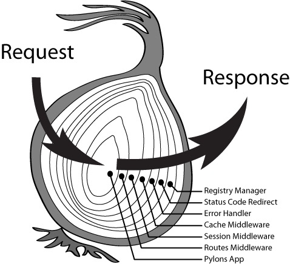

中间件是用于组成应用程序管道来处理请求和响应的组件。管道内的每一个组件都可以选择是否将请求交给下一个组件、并在管道中调用下一个组件之前和之后执行某些操作。请求委托被用来建立请求管道，请求委托处理每一个 HTTP 请求。


每个委托可以在下一个委托之前和之后执行操作。委托还可以决定不将请求传递给下一个委托，这称为请求管道的短路。

### Run

最简单的可能是ASP.NET Core应用程序建立一个请求的委托，处理所有的请求。此案例不包含实际的请求管道。相反，针对每个HTTP请求都调用一个匿名方法。

```csharp
app.Run(async (context) =>
{
    await context.Response.WriteAsync("Hello World!");
});
```
不管在浏览器地址栏输入什么，都会返回"Hello World!"


第一个**app.Run**委托会终止管道
```csharp
app.Run(async (context) =>
{
    await context.Response.WriteAsync("Hello World!");
});

app.Run(async (context) =>
{
    await context.Response.WriteAsync("管道已经被终止!");
});
```
只有"Hello World!"会被返回
### Use
如果需要使用多个委托处理HTTP请求，可以使用**Use**将他们链接在一起。

```csharp
app.Use(async (context, next) =>
{
    await context.Response.WriteAsync("进入第1个委托，执行下一个委托之前\r\n");
    await next();
    await context.Response.WriteAsync("结束第1个委托，执行下一个委托之后\r\n");
});
app.Use(async (context, next) =>
{
    await context.Response.WriteAsync("进入第2个委托，执行下一个委托之前\r\n");
    await next();
    await context.Response.WriteAsync("结束第2个委托，执行下一个委托之后\r\n");
});
app.Run(async (context) =>
{
    await context.Response.WriteAsync("Hello World!\r\n");
});
```




nodejs koa 洋葱模型


中间件的注册顺序也可重要

```csharp
    app.UseExceptionHandler("/Error");
    // Use HTTPS Redirection Middleware to redirect HTTP requests to HTTPS.
    app.UseHttpsRedirection();

    // Return static files and end the pipeline.
    app.UseStaticFiles();

    // Use Cookie Policy Middleware to conform to EU General Data 
    // Protection Regulation (GDPR) regulations.
    app.UseCookiePolicy();

    // Authenticate before the user accesses secure resources.
    app.UseAuthentication();

    // If the app uses session state, call Session Middleware after Cookie 
    // Policy Middleware and before MVC Middleware.
    app.UseSession();

    // Add MVC to the request pipeline.
    app.UseMvc();
```

异常处理中间件应该放到第一个，这样它就能捕获后面调用中发生的任何异常。

将非HTTPS重定向到HTTP域的中间件也应该比较前面，如果先经过Session等中间件处理，就会浪费服务器资源做不必要的解析。

尽早在管道中调用静态文件中间件，以便它可以处理请求并使其短路，而无需通过剩余组件。

身份验证的中间件(**app.UseAuthentication()**)不会使请求发生短路，作用是设置**HttpContext.User**上相关信息，短路操作是在MVC控制器执行的时候。


### Map