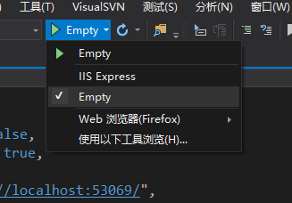

每个模板都具有的东西

### launchSettings.json

``` js
{
  "iisSettings": {
    "windowsAuthentication": false,
    "anonymousAuthentication": true,
    "iisExpress": {
      "applicationUrl": "http://localhost:53069/",
      "sslPort": 0
    }
  },
  "profiles": {
    "IIS Express": {
      "commandName": "IISExpress",
      "launchBrowser": true,
      "environmentVariables": {
        "ASPNETCORE_ENVIRONMENT": "Development"
      }
    },
    "Empty": {
      "commandName": "Project",
      "launchBrowser": true,
      "environmentVariables": {
        "ASPNETCORE_ENVIRONMENT": "Development"
      },
      "applicationUrl": "http://localhost:53070/"
    }
  }
}

```
项目启动设置，支持以IISExpress为宿主，或者自我宿主



### Startup.js

```csharp
using System;
using System.Collections.Generic;
using System.Linq;
using System.Threading.Tasks;
using Microsoft.AspNetCore.Builder;
using Microsoft.AspNetCore.Hosting;
using Microsoft.AspNetCore.Http;
using Microsoft.Extensions.DependencyInjection;

namespace Empty
{
    public class Startup
    {
        // This method gets called by the runtime. Use this method to add services to the container.
        // For more information on how to configure your application, visit https://go.microsoft.com/fwlink/?LinkID=398940
        public void ConfigureServices(IServiceCollection services)
        {
        }

        // This method gets called by the runtime. Use this method to configure the HTTP request pipeline.
        public void Configure(IApplicationBuilder app, IHostingEnvironment env)
        {
            if (env.IsDevelopment())
            {
                app.UseDeveloperExceptionPage();
            }

            app.Run(async (context) =>
            {
                await context.Response.WriteAsync("Hello World!");
            });
        }
    }
}

```
应用启动类，该类主要包括两个方法：
* ConfigureService：用于依赖服务注册
* Configure：用于指定应用程序将如何响应每一个 HTTP 请求。一般用于注册中间件

其中涉及到下以下几个可用服务：
* IServiceCollection：当前容器中各服务的配置集合，ASP.NET Core内置的依赖注入容器。
* IApplicationBuilder：用于构建应用程序的请求管道。
* IHostingEnvironment ：提供了当前的 EnvironmentName、WebRootPath 以及 ContentRoot等。

### Program.cs

```csharp
using System;
using System.Collections.Generic;
using System.IO;
using System.Linq;
using System.Threading.Tasks;
using Microsoft.AspNetCore;
using Microsoft.AspNetCore.Hosting;
using Microsoft.Extensions.Configuration;
using Microsoft.Extensions.Logging;

namespace Empty
{
    public class Program
    {
        public static void Main(string[] args)
        {
            BuildWebHost(args).Run();
        }

        public static IWebHost BuildWebHost(string[] args) =>
            WebHost.CreateDefaultBuilder(args)
                .UseStartup<Startup>()
                .Build();
    }
}
```
程序入口。

ASP.NET Core应用程序需要由Host（宿主）进行管理，宿主为其提供运行环境并负责启动。所以Main函数主要是用来初始化宿主环境，而宿主环境的初始化需要借助WebHostBuilder。初始化完毕后，调用Run()方法来启动应用程序。

* WebHost.CreaateDefaultBuilder()：创建WebHostBuilder。
* UseStartup<Startup>()：指定启动类，用于依赖注入和中间件注册。
* Build()：返回初始化完毕的IWebHost宿主。
* Run()：启动WebHost。

**CreateDefaultBuilder**源码
```csharp
public static IWebHostBuilder CreateDefaultBuilder(string[] args)
{
    var builder = new WebHostBuilder()
        //使用Kestrel作为Web server
        .UseKestrel()
        //指定Web host使用的content root（内容根目录），比如Views。
        //默认为当前应用程序根目录
        .UseContentRoot(Directory.GetCurrentDirectory())
        //设置当前应用程序配置。
        //主要是读取 appsettinggs.json 配置文件、
        //开发环境中配置的UserSecrets、添加环境变量和命令行参数 。
        .ConfigureAppConfiguration((hostingContext, config) =>
        {
            var env = hostingContext.HostingEnvironment;

            config.AddJsonFile("appsettings.json", optional: true, reloadOnChange: true)
                    .AddJsonFile($"appsettings.{env.EnvironmentName}.json", optional: true, reloadOnChange: true);

            if (env.IsDevelopment())
            {
                var appAssembly = Assembly.Load(new AssemblyName(env.ApplicationName));
                if (appAssembly != null)
                {
                    config.AddUserSecrets(appAssembly, optional: true);
                }
            }

            config.AddEnvironmentVariables();

            if (args != null)
            {
                config.AddCommandLine(args);
            }
        })
        //读取配置文件中的Logging节点，配置日志系统。
        .ConfigureLogging((hostingContext, logging) =>
        {
            logging.AddConfiguration(hostingContext.Configuration.GetSection("Logging"));
            logging.AddConsole();
            logging.AddDebug();
        })
        //使用IISIntegration 中间件
        .UseIISIntegration()
        //设置默认的依赖注入容器
        .UseDefaultServiceProvider((context, options) =>
        {
            options.ValidateScopes = context.HostingEnvironment.IsDevelopment();
        });
    return builder;
}
```