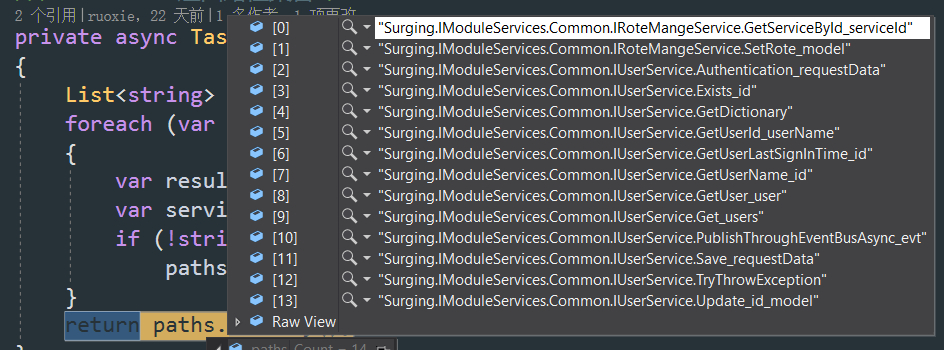
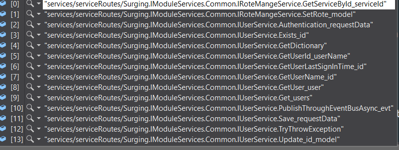

之前分析客户端路由调用的时候，并没有详细的分析如何从注册中心取回路由。

`ServiceProxyProvider`
```csharp
public async Task<T> Invoke<T>(IDictionary<string, object> parameters, string routePath, string serviceKey)
{
    var serviceRoute = await _serviceRouteProvider.GetRouteByPath(routePath.ToLower());
    T result = default(T);
    if (!string.IsNullOrEmpty(serviceKey))
    {
        var proxy = ServiceResolver.Current.GetService<RemoteServiceProxy>(serviceKey);
        if (proxy == null)
        {
            proxy = new RemoteServiceProxy(serviceKey, _serviceProvider);
            ServiceResolver.Current.Register(serviceKey, proxy);
        }
        result = await proxy.Invoke<T>(parameters, serviceRoute.ServiceDescriptor.Id);
    }
    else
    {
        var proxy = ServiceResolver.Current.GetService<RemoteServiceProxy>();
        if (proxy == null)
        {
            proxy = new RemoteServiceProxy(null, _serviceProvider);
            ServiceResolver.Current.Register(null, proxy);
        }
        result = await proxy.Invoke<T>(parameters, serviceRoute.ServiceDescriptor.Id);
    }
    return result;
}
```
!>routePath的例子为"`api/user/getuser`"

!>取回了路由，用到的主要是`ServiceDescriptor.Id`，也就是服务命令对应的Id，后面根据Id取到服务命令。

### DefaultServiceRouteProvider

服务在`AddCoreService`方法中注册：
`services.RegisterType(typeof(DefaultServiceRouteProvider)).As(typeof(IServiceRouteProvider)).SingleInstance();`

DefaultServiceRouteProvider中依赖`IServiceRouteManager`：
```csharp
private readonly ConcurrentDictionary<string, ServiceRoute> _concurrent = new ConcurrentDictionary<string, ServiceRoute>();
private readonly ConcurrentDictionary<string, ServiceRoute> _serviceRoute = new ConcurrentDictionary<string, ServiceRoute>();
private readonly IServiceRouteManager _serviceRouteManager;
public DefaultServiceRouteProvider(IServiceRouteManager serviceRouteManager, ILogger<DefaultServiceRouteProvider> logger)
{
    _serviceRouteManager = serviceRouteManager;
    serviceRouteManager.Changed += ServiceRouteManager_Removed;
    serviceRouteManager.Removed += ServiceRouteManager_Removed;
    serviceRouteManager.Created += ServiceRouteManager_Add;
    _logger = logger;
}
...
private static string GetCacheKey(ServiceDescriptor descriptor)
{
    return descriptor.Id;
}

private void ServiceRouteManager_Removed(object sender, ServiceRouteEventArgs e)
{
    var key = GetCacheKey(e.Route.ServiceDescriptor);
    ServiceRoute value;
    _concurrent.TryRemove(key, out value);
    _serviceRoute.TryRemove(e.Route.ServiceDescriptor.RoutePath, out value);
}

private void ServiceRouteManager_Add(object sender, ServiceRouteEventArgs e)
{
    var key = GetCacheKey(e.Route.ServiceDescriptor);
    _concurrent.GetOrAdd(key, e.Route);
    _serviceRoute.GetOrAdd(e.Route.ServiceDescriptor.RoutePath, e.Route);
}
...
```
!>_concurrent中键值为服务Id，_serviceRoute中键值为RoutePath。注册到serviceRouteManager相应事件上的委托也比较简单。

`IServiceRouteManager`的实现有`SharedFileServiceRouteManager`，`ConsulServiceRouteManager`，`ZooKeeperServiceRouteManager`。

以`ConsulServiceRouteManager`为例进行分析，服务注册：
```csharp
public static IServiceBuilder UseConsulRouteManager(this IServiceBuilder builder, ConfigInfo configInfo)
{
    return builder.UseRouteManager(provider =>
        new ConsulServiceRouteManager(
        configInfo,
        provider.GetRequiredService<ISerializer<byte[]>>(),
        provider.GetRequiredService<ISerializer<string>>(),
        provider.GetRequiredService<IClientWatchManager>(),
        provider.GetRequiredService<IServiceRouteFactory>(),
        provider.GetRequiredService<ILogger<ConsulServiceRouteManager>>()));
}
```
```csharp
public static IServiceBuilder UseRouteManager(this IServiceBuilder builder, Func<IServiceProvider, IServiceRouteManager> factory)
{
    builder.Services.RegisterAdapter(factory).InstancePerLifetimeScope();
    return builder;
}
```

中根据RoutePath获取服务路由：
```csharp
public ValueTask<ServiceRoute> GetRouteByPath(string path)
{
    _serviceRoute.TryGetValue(path.ToLower(), out ServiceRoute route);
    if (route == null)
    {
        return new ValueTask<ServiceRoute>(GetRouteByPathAsync(path));
    }
    else
    {
        return new ValueTask<ServiceRoute>(route);
    }
}
...
private async Task<ServiceRoute> GetRouteByPathAsync(string path)
{
    var routes = await _serviceRouteManager.GetRoutesAsync();
    var  route = routes.FirstOrDefault(i => i.ServiceDescriptor.RoutePath == path);
    if (route == null)
    {
        if (_logger.IsEnabled(LogLevel.Warning))
            _logger.LogWarning($"根据服务路由路径：{path}，找不到相关服务信息。");
    }
    else
        _serviceRoute.GetOrAdd(path, route);
    return route;
}
...
```
>从serviceRouteManager取回全部服务路由，根据RoutePath进行过滤，将目标路由缓存在_serviceRoute中。

### ConsulServiceRouteManager

```csharp
public override async Task<IEnumerable<ServiceRoute>> GetRoutesAsync()
{
    await EnterRoutes();
    return _routes;
}
...
private async Task EnterRoutes()
{
    if (_routes != null && _routes.Length > 0)
        return;

    var watcher = new ChildrenMonitorWatcher(_consul, _manager, _configInfo.RoutePath,
        async (oldChildrens, newChildrens) => await ChildrenChange(oldChildrens, newChildrens),
            (result) => ConvertPaths(result).Result);
    if (_consul.KV.Keys(_configInfo.RoutePath).Result.Response?.Count() > 0)
    {
        var result = await _consul.GetChildrenAsync(_configInfo.RoutePath);
        var keys = await _consul.KV.Keys(_configInfo.RoutePath);
        var childrens = result;
        watcher.SetCurrentData(ConvertPaths(childrens).Result.Select(key => $"{_configInfo.RoutePath}{key}").ToArray());
        _routes = await GetRoutes(keys.Response);
    }
    else
    {
        if (_logger.IsEnabled(Microsoft.Extensions.Logging.LogLevel.Warning))
            _logger.LogWarning($"无法获取路由信息，因为节点：{_configInfo.RoutePath}，不存在。");
        _routes = new ServiceRoute[0];
    }
}
```
`ChildrenMonitorWatcher`的逻辑在分析服务命令的时候已经详细介绍过，之前是基于CommandPath进行watch，这里是根据RoutePath。

```csharp
public static async Task<string[]> GetChildrenAsync(this ConsulClient client, string path)
{
    try
    {
        var queryResult = await client.KV.List(path);
        return queryResult.Response?.Select(p => Encoding.UTF8.GetString(p.Value)).ToArray();
    }
    catch (HttpRequestException)
    {
        return null;
    }
}
```
`GetChildrenAsync`获取的内容项类似：
```js
{
  "AddressDescriptors": [
    {
      "Type": "Surging.Core.CPlatform.Address.IpAddressModel",
      "Value": "{\"Ip\":\"127.0.0.1\",\"Port\":98,\"Token\":\"88904f103a3740529e960d9d230ce852\",\"DisableAuth\":false}"
    }
  ],
  "ServiceDescriptor": {
    "Id": "Surging.IModuleServices.Common.IRoteMangeService.GetServiceById_serviceId",
    "RoutePath": "api/rotemange/getservicebyid",
    "Metadatas": {
      "EnableAuthorization": false
    }
  }
}
```


`_consul.KV.Keys(_configInfo.RoutePath)`取回的内容：


!>RoutePath默认值为"`services/serviceRoutes/`"

!>ConsulServiceRouteManager构造函数中也会调用EnterRoutes方法。

```csharp
private async Task<string[]> ConvertPaths(string[] datas)
{
    List<string> paths = new List<string>();
    foreach (var data in datas)
    {
        var result = await GetRouteData(data);
        var serviceId = result?.ServiceDescriptor.Id;
        if (!string.IsNullOrEmpty(serviceId))
            paths.Add(serviceId);
    }
    return paths.ToArray();
}
```
`ConvertPaths`方法处理后返回内容类似：


就是服务Id列表。

`ChildrenMonitorWatcher`属性_currentData数据为：



` _routes = await GetRoutes(keys.Response);`：
```csharp
private async Task<ServiceRoute[]> GetRoutes(IEnumerable<string> childrens)
{

    childrens = childrens.ToArray();
    var routes = new List<ServiceRoute>(childrens.Count());

    foreach (var children in childrens)
    {
        if (_logger.IsEnabled(Microsoft.Extensions.Logging.LogLevel.Debug))
            _logger.LogDebug($"准备从节点：{children}中获取路由信息。");

        var route = await GetRoute(children);
        if (route != null)
            routes.Add(route);
    }

    return routes.ToArray();
}
private async Task<ServiceRoute> GetRoute(string path)
{
    ServiceRoute result = null;
    var watcher = new NodeMonitorWatcher(_consul, _manager, path,
            async (oldData, newData) => await NodeChange(oldData, newData));
    var queryResult = await _consul.KV.Keys(path);
    if (queryResult.Response != null)
    {
        var data = (await _consul.GetDataAsync(path));
        if (data != null)
        {
            watcher.SetCurrentData(data);
            result = await GetRoute(data);
        }
    }
    return result;
}
```
`var queryResult = await _consul.KV.Keys(path);`调用参数例子"services/serviceRoutes/Surging.IModuleServices.Common.IRoteMangeService.GetServiceById_serviceId"，`queryResult.Response`不为空例子"services/serviceRoutes/Surging.IModuleServices.Common.IRoteMangeService.GetServiceById_serviceId"

`GetDataAsync`方法直接根据path获取字节数据：
```csharp
public static async Task<byte[]> GetDataAsync(this ConsulClient client, string path)
{
    try
    {
        var queryResult = await client.KV.Get(path);
        return queryResult.Response?.Value;
    }
    catch (HttpRequestException)
    {
        return null;
    }
}
```

转为字符串例子为：
```js
{
  "AddressDescriptors": [
    {
      "Type": "Surging.Core.CPlatform.Address.IpAddressModel",
      "Value": "{\"Ip\":\"127.0.0.1\",\"Port\":98,\"Token\":\"88904f103a3740529e960d9d230ce852\",\"DisableAuth\":false}"
    }
  ],
  "ServiceDescriptor": {
    "Id": "Surging.IModuleServices.Common.IRoteMangeService.GetServiceById_serviceId",
    "RoutePath": "api/rotemange/getservicebyid",
    "Metadatas": {
      "EnableAuthorization": false
    }
  }
}
```

### 路由注册

```csharp
public static IServiceHostBuilder UseServer(this IServiceHostBuilder hostBuilder, string ip, int port, string token="True")
{
    return hostBuilder.MapServices(mapper =>
    {
        mapper.Resolve<IServiceCommandManager>().SetServiceCommandsAsync();
        var serviceEntryManager = mapper.Resolve<IServiceEntryManager>();
        bool enableToken;
        string serviceToken;
        string _ip = ip;
        if (ip.IndexOf(".") < 0 || ip == "" || ip == "0.0.0.0")
        {
            NetworkInterface[] nics = NetworkInterface.GetAllNetworkInterfaces();
            foreach (NetworkInterface adapter in nics)
            {
                if (adapter.NetworkInterfaceType == NetworkInterfaceType.Ethernet && (ip == "" || ip == "0.0.0.0" || ip == adapter.Name))
                {
                    IPInterfaceProperties ipxx = adapter.GetIPProperties();
                    UnicastIPAddressInformationCollection ipCollection = ipxx.UnicastAddresses;
                    foreach (UnicastIPAddressInformation ipadd in ipCollection)
                    {
                        if (ipadd.Address.AddressFamily == System.Net.Sockets.AddressFamily.InterNetwork)
                        {
                            _ip = ipadd.Address.ToString();
                        }
                    }
                }
            }
        }

        if (!bool.TryParse(token,out enableToken))
        {
                serviceToken= token;
        }
        else
        {
            if(enableToken) serviceToken = Guid.NewGuid().ToString("N");
            else serviceToken = null;
        }
        var addressDescriptors = serviceEntryManager.GetEntries().Select(i =>
        new ServiceRoute
        {
            Address = new[] { new IpAddressModel { Ip = _ip, Port = port, Token= serviceToken } },
            ServiceDescriptor = i.Descriptor
        }).ToList();
        mapper.Resolve<IServiceRouteManager>().SetRoutesAsync(addressDescriptors);
        var serviceHost = mapper.Resolve<Runtime.Server.IServiceHost>();
        Task.Factory.StartNew(async () =>
        {
            await serviceHost.StartAsync(new IPEndPoint(IPAddress.Parse(_ip), port));
        }).Wait();
    });
}
```
调用`mapper.Resolve<IServiceRouteManager>().SetRoutesAsync(addressDescriptors);`进行服务路由的注册。

获取`ServiceEntry`：
```csharp
public IEnumerable<ServiceEntry> GetEntries()
{
    var services = _types.Where(i =>
    {
        var typeInfo = i.GetTypeInfo();
        return typeInfo.IsInterface && typeInfo.GetCustomAttribute<ServiceBundleAttribute>() != null && _serviceProvider.Current.IsRegistered(i);
    }).Distinct().ToArray();

    if (_logger.IsEnabled(LogLevel.Information))
    {
        _logger.LogInformation($"发现了以下服务：{string.Join(",", services.Select(i => i.ToString()))}。");
    }
    var entries = new List<ServiceEntry>();
    foreach (var service in services)
    {
        entries.AddRange( _clrServiceEntryFactory.CreateServiceEntry(service));
    }
    return entries;
}
```
```csharp
public IEnumerable<ServiceEntry> CreateServiceEntry(Type service)
{
    var routeTemplate = service.GetCustomAttribute<ServiceBundleAttribute>() ;
    foreach (var methodInfo in service.GetTypeInfo().GetMethods())
    {
        yield return Create(methodInfo,service.Name, routeTemplate.RouteTemplate);
    }
}
private ServiceEntry Create(MethodInfo method, string serviceName, string routeTemplate)
{
    var serviceId = _serviceIdGenerator.GenerateServiceId(method);
    var attributes = method.GetCustomAttributes().ToList();
    var serviceDescriptor = new ServiceDescriptor
    {
        Id = serviceId,
        RoutePath = RoutePatternParser.Parse(routeTemplate, serviceName, method.Name)
    };

    var descriptorAttributes = method.GetCustomAttributes<ServiceDescriptorAttribute>();
    foreach (var descriptorAttribute in descriptorAttributes)
    {
        descriptorAttribute.Apply(serviceDescriptor);
    }
    var authorization = attributes.Where(p => p is AuthorizationFilterAttribute).FirstOrDefault();
    serviceDescriptor.EnableAuthorization(authorization != null);
    if (authorization != null)
    {
        ;
        serviceDescriptor.AuthType(((authorization as AuthorizationAttribute)?.AuthType)
            ?? AuthorizationType.AppSecret);
    }
    var fastInvoker = GetHandler(serviceId, method);
    return new ServiceEntry
    {
        Descriptor = serviceDescriptor,
        Attributes = attributes,
        Func = (key, parameters) =>
        {
            var instance = _serviceProvider.GetInstances(key, method.DeclaringType);
            var list = new List<object>();

            foreach (var parameterInfo in method.GetParameters())
            {
                var value = parameters[parameterInfo.Name];
                var parameterType = parameterInfo.ParameterType;
                var parameter = _typeConvertibleService.Convert(value, parameterType);
                list.Add(parameter);
            }
            var result = fastInvoker(instance, list.ToArray());
            return Task.FromResult(result);
        }
    };
}
```
生成`RoutePath`：
```csharp
var serviceDescriptor = new ServiceDescriptor
{
    Id = serviceId,
    RoutePath = RoutePatternParser.Parse(routeTemplate, serviceName, method.Name)
};
```
传入参数"Api/{Service}"，"IRoteMangeService"，"GetServiceById"，返回"api/rotemange/getservicebyid"。

注册路由：
```csharp
public override async Task SetRoutesAsync(IEnumerable<ServiceRoute> routes)
{
    var serviceRoutes = await GetRoutes(routes.Select(p => $"{ _configInfo.RoutePath}{p.ServiceDescriptor.Id}"));
    foreach (var route in routes)
    {
        var serviceRoute = serviceRoutes.Where(p => p.ServiceDescriptor.Id == route.ServiceDescriptor.Id).FirstOrDefault();
        if (serviceRoute != null)
        {
            route.Address = serviceRoute.Address.Concat(
                route.Address.Except(serviceRoute.Address));
        }
    }
    await RemoveExceptRoutesAsync(routes);
    await base.SetRoutesAsync(routes);
}
```
一开始`serviceRoutes`从注册中心取不回数据，还没有注册过。

>如果服务是多机部署，后启动的就可以从注册中心取回路由信息，之后会合并调用地址。

`RemoveExceptRoutesAsync`方法传入新路由(本地)，筛选出要删除的路由(注册中心)，如果调用地址相同，则删除注册中心的旧路由。
```csharp
private async Task RemoveExceptRoutesAsync(IEnumerable<ServiceRoute> routes)
{
    routes = routes.ToArray();

    if (_routes != null)
    {
        var oldRouteIds = _routes.Select(i => i.ServiceDescriptor.Id).ToArray();
        var newRouteIds = routes.Select(i => i.ServiceDescriptor.Id).ToArray();
        var deletedRouteIds = oldRouteIds.Except(newRouteIds).ToArray();
        foreach (var deletedRouteId in deletedRouteIds)
        {
            var addresses=  _routes.Where(p => p.ServiceDescriptor.Id == deletedRouteId).Select(p=>p.Address).FirstOrDefault();
            foreach (var address in addresses)
            {
                if (routes.Any(p => p.Address.Select(a=>a.ToString()).Contains(address.ToString())))
                    await _consul.KV.Delete($"{_configInfo.RoutePath}{deletedRouteId}");
            }
        }
    }
}
```

调用基类`SetRoutesAsync`方法，将`ServiceRoute`处理为`ServiceRouteDescriptor`：
```csharp
public virtual Task SetRoutesAsync(IEnumerable<ServiceRoute> routes)
{
    if (routes == null)
        throw new ArgumentNullException(nameof(routes));

    var descriptors = routes.Where(route => route != null).Select(route => new ServiceRouteDescriptor
    {
        AddressDescriptors = route.Address?.Select(address => new ServiceAddressDescriptor
        {
            Type = address.GetType().FullName,
            Value = _serializer.Serialize(address)
        }) ?? Enumerable.Empty<ServiceAddressDescriptor>(),
        ServiceDescriptor = route.ServiceDescriptor
    });

    return SetRoutesAsync(descriptors);
}
```

调用实现类的`SetRoutesAsync`方法，将路由注册到注册中心:
```csharp
protected override async Task SetRoutesAsync(IEnumerable<ServiceRouteDescriptor> routes)
{
    
    foreach (var serviceRoute in routes)
    {
        var nodeData = _serializer.Serialize(serviceRoute);
        var keyValuePair = new KVPair($"{_configInfo.RoutePath}{serviceRoute.ServiceDescriptor.Id}") { Value = nodeData };
        await _consul.KV.Put(keyValuePair);
    }
}
```

`ChildrenMonitorWatcher`类型的的watcher一直周期性的根据RoutePath从注册中心拉取Key列表。然后调用`ChildrenChange`方法进行节点的更新。

### 寻址调用

`BreakeRemoteInvokeService`：
```csharp
var message = await _remoteInvokeService.InvokeAsync(new RemoteInvokeContext
{
    InvokeMessage = new RemoteInvokeMessage
    {
        Parameters = parameters,
        ServiceId = serviceId,
        ServiceKey = serviceKey,
        DecodeJOject = decodeJOject,
    }
}, requestTimeout);
```

`RemoteInvokeService`：
```csharp
public async Task<RemoteInvokeResultMessage> InvokeAsync(RemoteInvokeContext context, int requestTimeout)
{
    var invokeMessage = context.InvokeMessage;
    var address = await ResolverAddress(context);
    try
    {
        var endPoint = address.CreateEndPoint();
        invokeMessage.Token = address.Token;
        if (_logger.IsEnabled(LogLevel.Debug))
            _logger.LogDebug($"使用地址：'{endPoint}'进行调用。");
        var client = _transportClientFactory.CreateClient(endPoint);
        return await client.SendAsync(invokeMessage).WithCancellation(requestTimeout);
    }
    catch (CommunicationException)
    {
        await _healthCheckService.MarkFailure(address);
        throw;
    }
    catch (Exception exception)
    {
        _logger.LogError(exception, $"发起请求中发生了错误，服务Id：{invokeMessage.ServiceId}。");
        throw;
    }
}
...
private async ValueTask<AddressModel> ResolverAddress(RemoteInvokeContext context)
{
    if (context == null)
        throw new ArgumentNullException(nameof(context));

    if (context.InvokeMessage == null)
        throw new ArgumentNullException(nameof(context.InvokeMessage));

    if (string.IsNullOrEmpty(context.InvokeMessage.ServiceId))
        throw new ArgumentException("服务Id不能为空。", nameof(context.InvokeMessage.ServiceId));
    var invokeMessage = context.InvokeMessage;
    var hashCode = context.InvokeMessage.Parameters.GetHashCode();
    var address = await _addressResolver.Resolver(invokeMessage.ServiceId, hashCode);
    if (address == null)
        throw new CPlatformException($"无法解析服务Id：{invokeMessage.ServiceId}的地址信息。");
    return address;
}
...
```
_addressResolver服务：

客户端：

```csharp
public static IServiceBuilder AddClientRuntime(this IServiceBuilder builder)
{
    var services = builder.Services;
    services.RegisterType(typeof(DefaultHealthCheckService)).As(typeof(IHealthCheckService)).SingleInstance();
    services.RegisterType(typeof(DefaultAddressResolver)).As(typeof(IAddressResolver)).SingleInstance();
    services.RegisterType(typeof(RemoteInvokeService)).As(typeof(IRemoteInvokeService)).SingleInstance();
    return builder.UseAddressSelector().AddRuntime().AddClusterSupport();
}
```

服务端：

```csharp
public static IServiceBuilder AddRelateServiceRuntime(this IServiceBuilder builder)
{
    var services = builder.Services;
    services.RegisterType(typeof(DefaultHealthCheckService)).As(typeof(IHealthCheckService)).SingleInstance();
    services.RegisterType(typeof(DefaultAddressResolver)).As(typeof(IAddressResolver)).SingleInstance();
    services.RegisterType(typeof(RemoteInvokeService)).As(typeof(IRemoteInvokeService)).SingleInstance();
    return builder.UseAddressSelector().AddClusterSupport();
}
```
!>`DefaultAddressResolver`中依赖`DefaultHealthCheckService`

```csharp
public async ValueTask<AddressModel> Resolver(string serviceId,int hashCode)
{
    if (_logger.IsEnabled(LogLevel.Debug))
        _logger.LogDebug($"准备为服务id：{serviceId}，解析可用地址。");
    _concurrent.TryGetValue(serviceId, out ServiceRoute descriptor);
    if (descriptor==null)
    {
        var descriptors = await _serviceRouteManager.GetRoutesAsync();
        descriptor = descriptors.FirstOrDefault(i => i.ServiceDescriptor.Id == serviceId);
        if (descriptor != null)
        {
            _concurrent.GetOrAdd(serviceId, descriptor);
        }
        else
        {
            if (descriptor == null)
            {
                if (_logger.IsEnabled(LogLevel.Warning))
                    _logger.LogWarning($"根据服务id：{serviceId}，找不到相关服务信息。");
                return null;
            }
        }
    }
    
    var address = new List<AddressModel>();
    foreach (var addressModel in descriptor.Address)
    {
            _healthCheckService.Monitor(addressModel);
        if (!await _healthCheckService.IsHealth(addressModel))
            continue;

        address.Add(addressModel);
    }
    
    if (address.Count==0)
    {
        if (_logger.IsEnabled(LogLevel.Warning))
            _logger.LogWarning($"根据服务id：{serviceId}，找不到可用的地址。");
        return null;
    }

    if (_logger.IsEnabled(LogLevel.Information))
        _logger.LogInformation($"根据服务id：{serviceId}，找到以下可用地址：{string.Join(",", address.Select(i => i.ToString()))}。");

    return await _addressSelector.SelectAsync(new AddressSelectContext
    {
        Descriptor = descriptor.ServiceDescriptor,
        Address = address,
        HashCode= hashCode
    });
}
```


