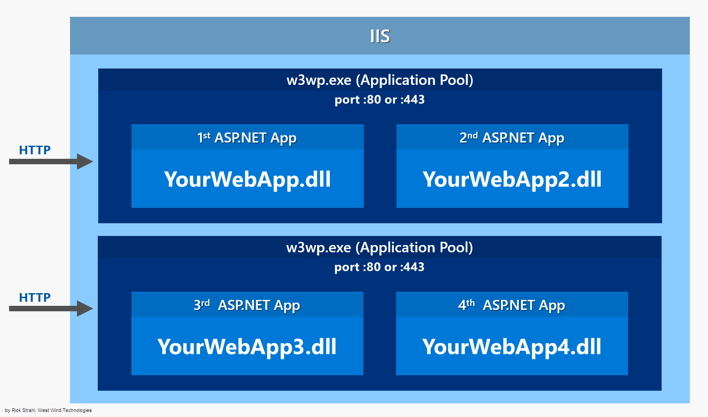
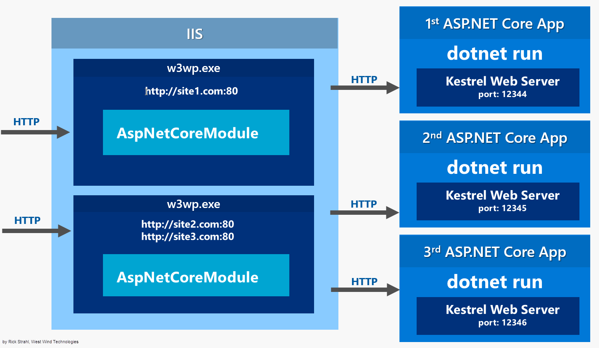
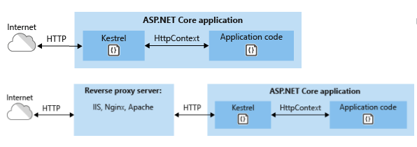

我们创建的.net core web application其实质是一个独立的控制台应用程序，不能直接处理Http请求，需要借助Web Server向外提供服务。

.net core中默认使用内置的支持跨平台的Kestrel作为web server（当然还有其他web server可供选择，比如WebListener、Http.sys等等）。

Web Server可以使用宿主环境来承载它(比如使用IIS)，也可以是自宿的(类似直接运行控制台程序)。

### IIS 作为宿主

以前的 ASP.NET 以IIS为宿主：

ASP.NET 是严重依赖于IIS的，System.Web 中有很多方法都是直接调用的 IIS API，并且它还是驻留在IIS进程中的。而 ASP.NET Core 的运行则是一个完全独立的控制台程序，它有自己的 Kestrel Server，可以直接对外部提供服务。

不过 Kestrel 的功能相对较于简单，所以我们还是需要一个反向代理服务器将 Kestrel 服务器保护起来。而微软也为我们提供了 UseIISIntegration 方法，方便与IIS进行集成。因此，在 Windows 下，通常还是使用IIS来部署，那么，此时与 ASP.NET 的运行方式又有什么区别呢？

通过上图，可以很清楚的明白它们的区别。在 ASP.NET Core 中，IIS 是通过 HTTP 的方式来调用我们的 ASP.NET Core 程序。而部署在IIS中时，并不需要我们手动来启动 ASP.NET Core 的控制台程序，这是因为IIS新增了一个 AspNetCoreModule 模块，它负责 ASP.NET Core 程序的启动与停止，并能监听 ASP.NET Core 程序的状态，在我们的应用程序意外崩溃时重新启动。

### 自宿

直接运行.net core web application的控制台程序即可启动一个可以处理http请求的web程序，其内部就是使用Kestrel处理http请求。

当仅仅是在内网中暴露服务或者不需要进行负载，可以直接运行程序。否则，还是借助反向代理服务器（IIS、Nginx、Apache等）来转发http请求。一般建议结合使用反向代理服务器来处理http请求，因为反向代理服务器可以在Kestrel之前做一些额外的处理，比如负载均衡等。

直接运行.net core web程序，当程序意外崩溃时，并不能自动进行重启。

为了保证服务能够稳定运行，可以使用守护进程以确保在应用程序出现异常中断时能够正常重启，比如使用进程管理程序`Supervisor`进行管控。

或者将程序部署到`docker`容器中。